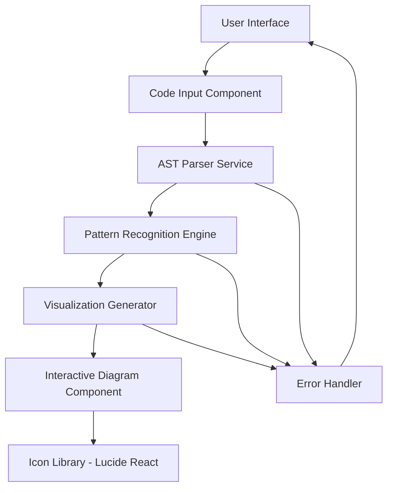

# Design Document

## Overview

ghee is a React-based web application that transforms JavaScript/TypeScript code into intuitive visual diagrams. The system uses Abstract Syntax Tree (AST) parsing to analyze code patterns and generates interactive flow diagrams using icons from Lucide React. The architecture emphasizes simplicity, performance, and accessibility while providing engaging visual representations of code logic.

## Architecture

### High-Level Architecture



### Technology Stack

- **Frontend Framework**: React 18 with TypeScript
- **AST Parsing**: @babel/parser for JavaScript/TypeScript parsing
- **Pattern Recognition**: Custom pattern matching engine
- **Visualization**: React Flow for interactive diagrams
- **Icons**: Lucide React icon library
- **Styling**: Tailwind CSS for responsive design
- **State Management**: React Context API for application state

## Components and Interfaces

### 1. Code Input Component

**Purpose**: Handles code input with syntax highlighting and validation

**Key Features**:

- Large textarea with placeholder text
- Syntax highlighting using Prism.js or Monaco Editor
- Real-time validation feedback
- "Visualize Code" button with loading states

**Interface**:

```typescript
interface CodeInputProps {
  onCodeSubmit: (code: string) => void;
  isProcessing: boolean;
  onCancel?: () => void;
}
```

### 2. AST Parser Service

**Purpose**: Converts JavaScript/TypeScript code into analyzable AST

**Key Features**:

- Babel parser integration for robust parsing
- Error handling for syntax errors
- Support for both JavaScript and TypeScript
- React-specific parsing capabilities

**Interface**:

```typescript
interface ASTParserService {
  parseCode(code: string): Promise<ParseResult>;
  validateSyntax(code: string): ValidationResult;
}

interface ParseResult {
  ast: Node;
  errors: ParseError[];
  language: "javascript" | "typescript";
}
```

### 3. Pattern Recognition Engine

**Purpose**: Identifies common code patterns for visualization

**Supported Patterns**:

- Counter/Button patterns (useState + onClick)
- API call patterns (fetch/axios)
- Database operation patterns
- React component lifecycle patterns
- Error handling patterns (try-catch)

**Interface**:

```typescript
interface PatternRecognitionEngine {
  recognizePatterns(ast: Node): RecognizedPattern[];
}

interface RecognizedPattern {
  type:
    | "counter"
    | "api-call"
    | "database"
    | "component-lifecycle"
    | "error-handling";
  nodes: PatternNode[];
  connections: PatternConnection[];
  metadata: PatternMetadata;
}
```

### 4. Visualization Generator

**Purpose**: Converts recognized patterns into visual diagram data

**Key Features**:

- Maps patterns to appropriate Lucide React icons
- Generates node positions and connections
- Creates color-coded arrows (green for success, red for errors)
- Adds simple explanations for each element

**Interface**:

```typescript
interface VisualizationGenerator {
  generateDiagram(patterns: RecognizedPattern[]): DiagramData;
}

interface DiagramData {
  nodes: VisualNode[];
  edges: VisualEdge[];
  layout: LayoutConfig;
}
```

### 5. Interactive Diagram Component

**Purpose**: Renders the interactive flow diagram

**Key Features**:

- React Flow integration for interactive diagrams
- Custom node components with Lucide React icons
- Tooltip system for simple explanations
- Responsive layout that adapts to screen size
- Click handlers for detailed information

**Interface**:

```typescript
interface InteractiveDiagramProps {
  diagramData: DiagramData;
  onNodeClick: (nodeId: string) => void;
  onEdgeClick: (edgeId: string) => void;
}
```

## Data Models

### Visual Node Model

```typescript
interface VisualNode {
  id: string;
  type:
    | "button"
    | "counter"
    | "api"
    | "database"
    | "user"
    | "component"
    | "error";
  position: { x: number; y: number };
  icon: LucideIcon;
  label: string;
  explanation: string;
  metadata: NodeMetadata;
}
```

### Visual Edge Model

```typescript
interface VisualEdge {
  id: string;
  source: string;
  target: string;
  label: string;
  type: "success" | "error" | "action" | "data-flow";
  color: string;
  animated?: boolean;
}
```

### Pattern Metadata Model

```typescript
interface PatternMetadata {
  confidence: number;
  codeLocation: { start: number; end: number };
  variables: string[];
  functions: string[];
  complexity: "simple" | "medium" | "complex";
}
```

## Error Handling

### Error Types and Handling Strategy

1. **Syntax Errors**

   - Display user-friendly error messages
   - Highlight problematic code sections
   - Provide suggestions for common fixes

2. **Unsupported Code Patterns**

   - Graceful degradation to basic visualization
   - Clear messaging about unsupported features
   - Suggestions for supported alternatives

3. **Performance Issues**

   - Code complexity analysis before processing
   - Timeout handling for large code files
   - Progressive loading for complex diagrams

4. **Visualization Errors**
   - Fallback to simplified diagrams
   - Error boundaries to prevent app crashes
   - Retry mechanisms for transient failures

### Error Recovery Mechanisms

```typescript
interface ErrorHandler {
  handleParseError(error: ParseError): UserFriendlyError;
  handlePatternError(error: PatternError): FallbackVisualization;
  handleVisualizationError(error: VisualizationError): SimplifiedDiagram;
}
```

## Testing Strategy

### Unit Testing

- **AST Parser Service**: Test parsing accuracy for various code samples
- **Pattern Recognition Engine**: Verify pattern detection for known code structures
- **Visualization Generator**: Ensure correct diagram generation from patterns
- **Individual Components**: Test component behavior and prop handling

### Integration Testing

- **End-to-End Flow**: Test complete code-to-visualization pipeline
- **Error Scenarios**: Verify error handling across component boundaries
- **Performance Testing**: Ensure acceptable response times for typical code samples

### User Acceptance Testing

- **Pattern Recognition Accuracy**: Verify visualizations match expected patterns
- **Usability Testing**: Ensure interface is intuitive for target users
- **Accessibility Testing**: Verify compliance with accessibility standards

### Test Data Strategy

```typescript
interface TestCodeSamples {
  counterPatterns: string[];
  apiCallPatterns: string[];
  databasePatterns: string[];
  errorHandlingPatterns: string[];
  complexCombinations: string[];
  edgeCases: string[];
}
```

### Testing Tools

- **Unit Tests**: Jest + React Testing Library
- **E2E Tests**: Playwright for full user journey testing
- **Visual Regression**: Chromatic for diagram consistency
- **Performance**: Lighthouse CI for performance monitoring

## Performance Considerations

### Code Processing Optimization

- Implement worker threads for AST parsing to avoid UI blocking
- Cache parsed results for repeated code submissions
- Implement progressive parsing for large files

### Visualization Rendering

- Use React.memo for expensive diagram components
- Implement virtual scrolling for large diagrams
- Optimize icon rendering with sprite sheets

### Memory Management

- Clean up AST objects after processing
- Implement diagram cleanup on component unmount
- Monitor memory usage for large code files

## Accessibility Features

### Visual Accessibility

- High contrast mode for diagrams
- Scalable text and icons
- Alternative text for all visual elements

### Interaction Accessibility

- Keyboard navigation for all interactive elements
- Screen reader support for diagram descriptions
- Focus management for modal dialogs and tooltips

### Cognitive Accessibility

- Simple, jargon-free explanations
- Consistent visual patterns
- Progressive disclosure of complex information
